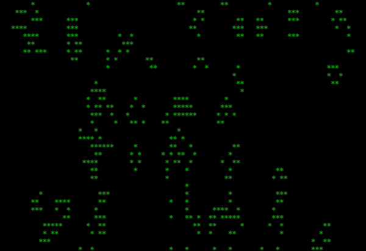

# Conway's Game of Life
[Conway's Game of Life](https://en.wikipedia.org/wiki/Conway%27s_Game_of_Life) in Python 3.6.



**Simulate for a random world:**
```python
from life import Cell, originate_from, WrappedUniverse


# Create a random wrapped universe of 10 x 10
universe = WrappedUniverse.random(10, 10, Cell.likely)
# Get a universe generator iterator
life = originate_from(universe, regenerate=Cell)

# Iterate through life and print the universe on each step
for universe in life:
    print(universe)
    input('Press Enter to continue...')
```

**Simulate for a world from [ASCII art](https://www.ascii-code.com/ascii-art/):**
```python
from life import originate_from, WrappedUniverse


with open('universe.txt') as file:
    # Create a universe from the file
    universe = WrappedUniverse.from_data(file.readlines(), is_cell=lambda s: not s.isspace())

# Get a universe generator iterator
life = originate_from(universe, regenerate=lambda: '*')

# Iterate through life and print the universe on each step
for universe in life:
    print(universe)
    input('Press Enter to continue...')
```

## Demo

```bash
# Simulate a random 'The Game of Life' in a Posix-compatible terminal
python3 main.py
```

## Technology Stack
|                      | Technology                                         |
| -------------------- |----------------------------------------------------|
| Language             | [Python 3.6](https://www.python.org/)              |
| Linter               | [Flake8 3.5](http://flake8.pycqa.org/en/latest/)   |

## Development
### Prerequisites
1. [Python 3.6](https://www.python.org/downloads/)

### Quickstart

```bash
# Create a Python virtual environment
python3 -m venv .venv

# Activate a Python virtual environment
.venv/bin/activate

# Install the dependencies
$ pip install -r requirements.txt
```

### Unit Tests
Use [test discovery](https://docs.python.org/3/library/unittest.html#test-discovery) to run all unit tests at once.

```bash
Run tests
python -m unittest discover
```

### Styleguide
The project uses [PEP8](https://www.python.org/dev/peps/pep-0008/). [Flake8](http://flake8.pycqa.org/en/latest/) is setup to enforce the rules.

```bash
Run flake8
flake8
```
